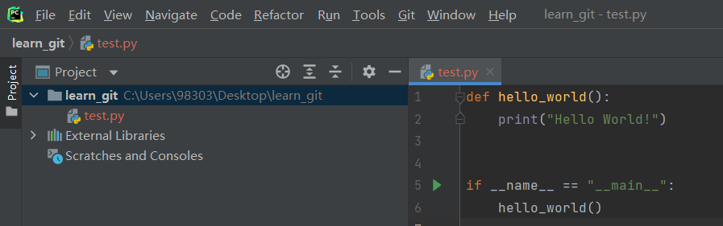
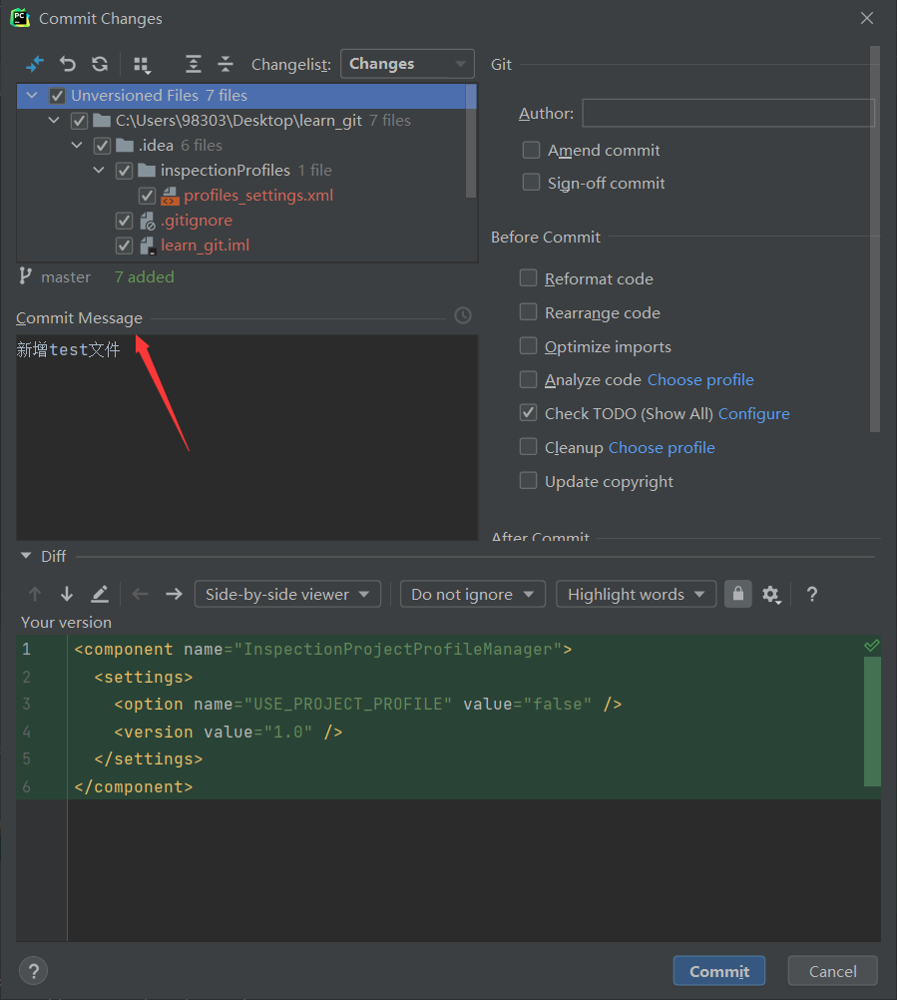
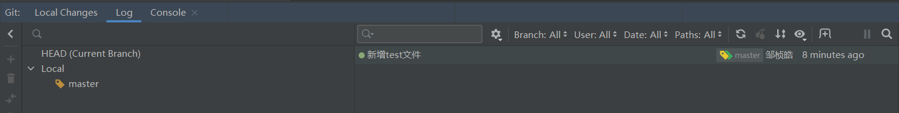
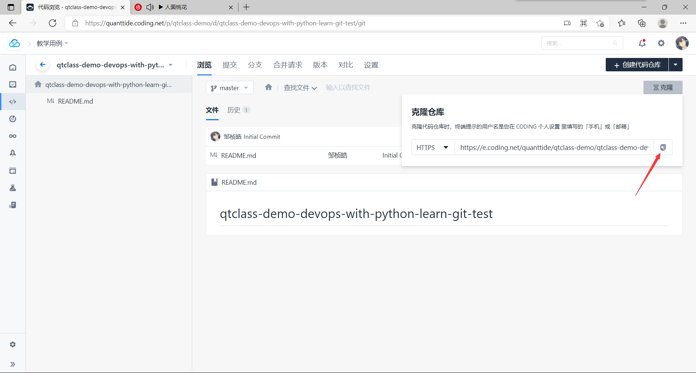
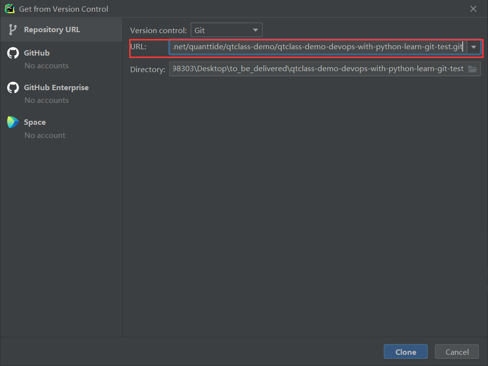
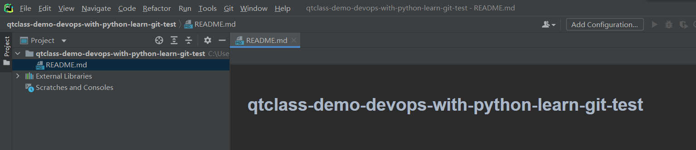
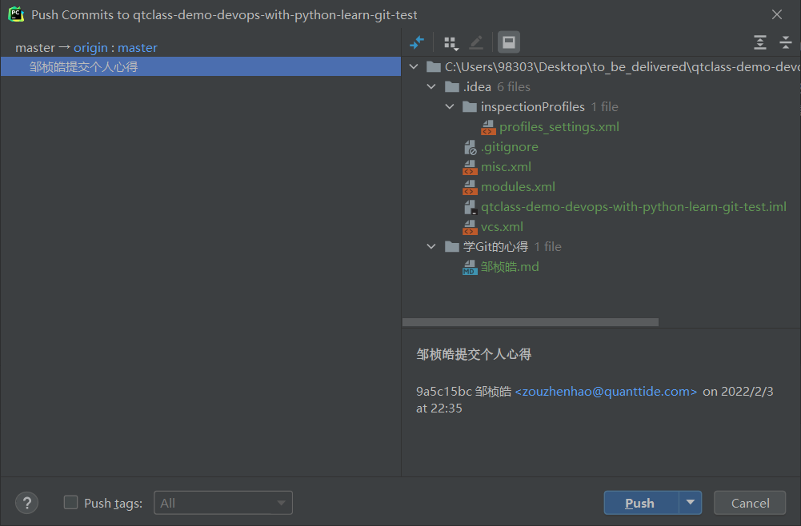

# 单人使用

假设新创建项目只有一个人开始用，或者全过程只有单人使用。
1. 提交更变到本地仓库（add、commit）。
2. 远端创建仓库（或者仓库已存在），下载（clone）到本地。
3. 提交到远端仓库（push）。

## 提交更变到本地仓库（add、commit）

用pycharm打开learn_git文件夹，这时我们可以做我们想要进行的编程操作。

在忙碌了一天 过后，我们要把本地的文件改动提交到本地git仓库，步骤如下：

1. 上方工具栏点击Git-Commit
2. 选中提交文件，填写Commit Message

左上角是用来选中提交哪些文件的，一般默认全选；右边是填写一些诸如作者的提交信息，
可以留空；左边是提交信息，需要对本次提交作描述，该描述是必填的，可以方便后续做版本
回退，也是方便别人一眼看出来你做了哪些改动。

填完描述信息后点击Commit。改动成功提交后打开Git log（快捷键Alt + 9），发现当前
Local changes没有任何改动，说明我们的所有改动已经提交到Git仓库中，点击右边的log，
可以看到我们的第一次提交：新增Git文件。

## 远端仓库下载（clone）到本地
为方便内部人员学习，我们在Coding上建立了一个供Git学习者随意练习的远程仓库。

链接：https://quanttide.coding.net/p/qtclass-demo/d/qtclass-demo-devops-with-python-learn-git-test/git

接下来我们学习如何获取这个仓库的代码，还有如何提交代码到这个仓库上。

1. 点开上方链接，找到qtclass-demo-devops-with-python-learn-git-test
代码仓库，点击克隆，复制代码仓库地址。

2. 返回pycharm，上方Git-Clone...

将复制的URL地址粘贴到对应框中，点击clone。第一次clone会要求提供账号和密码，这是
注册coding账号时的账号和密码，填一次后记住就可。

代码仓库克隆成功~~~

## 提交到代码仓库
在代码仓库克隆之后我们可以在本地进行修改，本人调皮地新建了一个个人心得文件夹。
大家可以有啥心得包括啥改进意见都可以在里面写。

1.编写完之后，先在本地提交，详情参照“提交变更到本地仓库”
2.上方Git-Push，选中你要提交的change，点击push

然后我们再次刷新代码仓库的链接，神奇的事情发生了，我们本地的修改提交到了远程仓库。