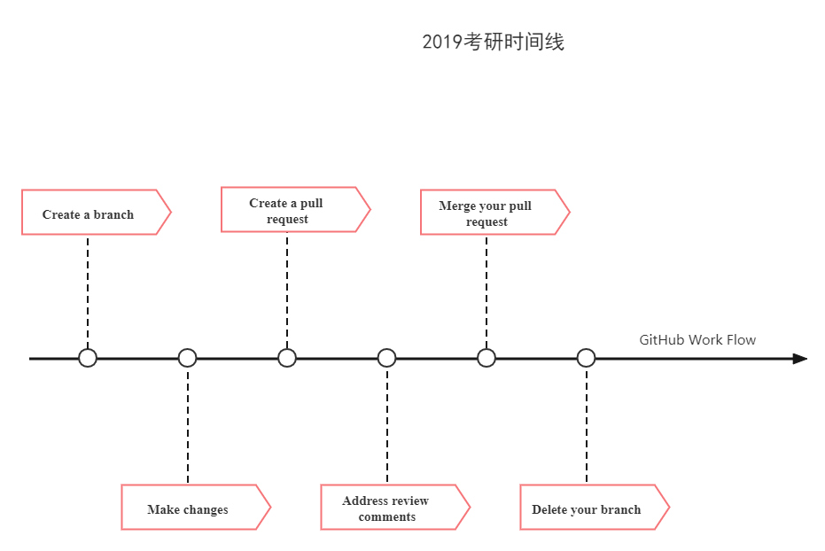
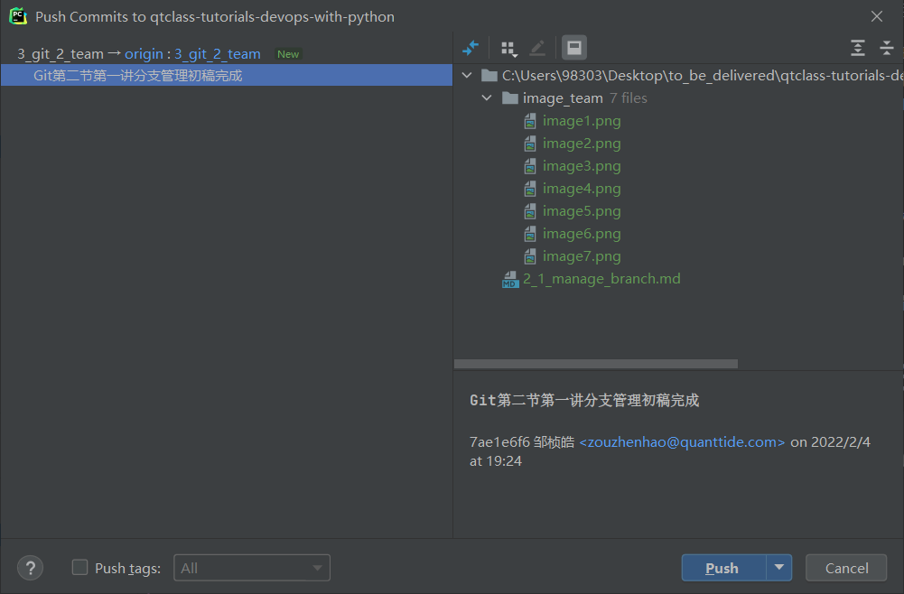
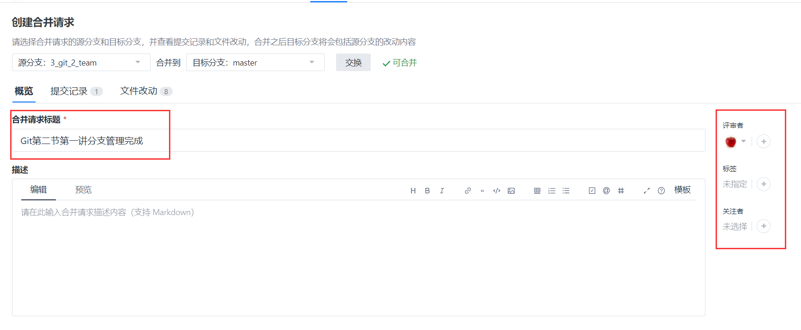

# 目录
1. GitHub工作流介绍
2. 创建新的分支并提交更变到本地仓库（branch）。
3. 提交新建分支到远端仓库（push）。
4. 提交合并请求（pull request）、邀请其他团队成员评审（code review）、合并提交（merge）。

## GitHub工作流介绍

GitHub工作流的大致流程如下：
1. 在master分支上新建feature分支
2. 在feature分支上做想要的更改
3. 发起合并请求
4. 进行代码评审
5. 如果通过评审，则合并所提交的代码。
6. 删除该feature分支

下面以一段具体的案例为例介绍GitHub工作流，这也是大部分量潮教程执行的工作流。

## 前期准备
- 从远程代码仓库克隆项目到本地

比如我们需要完成Git分支管理教程，那么首先第一步是先去devops代码仓库将整个项目克隆到本地
仓库链接：https://quanttide.coding.net/p/qtclass-courses/d/qtclass-tutorials-cloud-computing-with-python/git
具体克隆教程详见第一节。

- 在本地新建feature分支

本案例中该feature分支命名为“3_git_2_team”

- 完成后在本地提交（commit）修改

commit message为“Git第二节第一讲分支管理初稿完成”

## 将本地feature分支提交到远程仓库
上方Git-Push，选中“Git第二节第一讲分支管理初稿完成”，点击push

## 提交合并请求，邀请团队成员评审

打开对应coding代码仓库，切换到分支模块，我们可以发现本地的feature分支已经提交
到了coding远程仓库，我们可以在右侧创建合并请求。

我们填好标题，添加评审者后，就可以创建合并请求了。在经过评审者评审后，就可以合并到master分支了，
接下来该feature分支就可以删除了。Github工作流要求feature分支存在的时间尽可能短。

