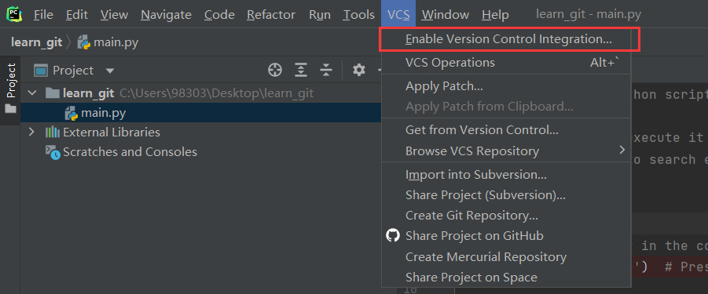
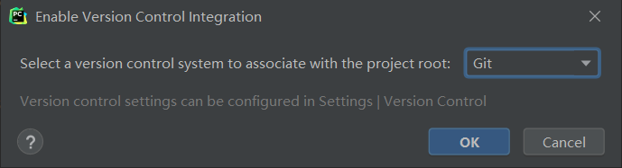

# 本地环境

## 安装Git

### 配置Git账号

## 安装GUI工具

Git命令对于很多新手来说不是特别友好，我们这里介绍几种常用的GUI工具，包括SourceTree、VSCode、PyCharm（JetBrain的IDEA系）。

### SourceTree

### VSCode

### PyCharm

## 尝试基础操作——新建一个git仓库

下面我们来试验一下Git的基础操作，看看是不是可以正常使用，并且顺便初步熟悉一下Git的基本概念。本节不要求读者掌握，在后面两节中会逐步通过完整的操作流程熟悉他们的作用。

具体步骤：

1、在桌面新建一个learn_git文件夹

2、选中learn_git文件夹右键“open folder as Pycharm project”打开文件夹

3、从上方工具栏中找到vcs(version control system)，选中Enable Version Control...

4、选中Git，点击ok

5、现在我们就拥有了一个本地的git仓库

我们打开文件夹，可以发现当前目录下多了一个.git的目录，这个目录是Git来跟踪管理版本库的，
没事千万不要手动修改这个目录里面的文件，不然改乱了，就把Git仓库给破坏了。