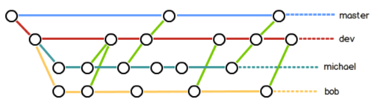
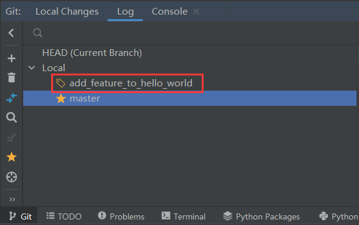
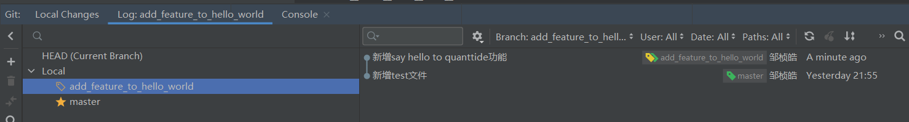
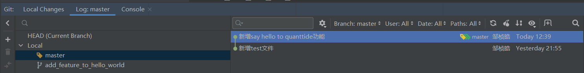
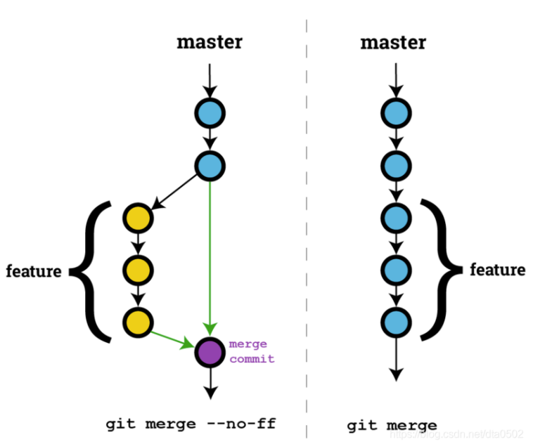

# 分支管理
## 目录
1. 一个简单的分支应用场景
2. 本地新建一个feature分支
3. 合并feature分支到master分支
4. 补充：fast-forward和no-fast-forward区别

## 一个简单的分支应用场景
比如你和你的程序员朋友们被要求写一个大型的程序，正常的思路是把这个程序所需要的模块进行拆分，
然后每个人完成一部分，最后再整合。
那我们就可以把写一个大型程序看成Git的master主分支，
我们每个人从master主分支拉取一个feature分支，我们就在feature分支上工作，
工作完后再提交到master主分支。大致流程如下图：



我们可以把master分支（生产分支）看成我们的最终产品，
dev分支（预生产分支）看成我们的即将上线但是仍需测试的产品，
michael和bob每次需要在dev分支上拉取自己的分支，
完成自己阶段性工作后提交到dev分支上进行测试，
测试通过后再提交到master分支正式上线。

git的出现使得一个大型程序能够同时被数百人数千人同时完成，大大提高了生产效率，
下面我们学习分支管理基本操作——如何在本地新建feature分支，
如何将feature分支提交到master分支

## 本地新建一个feature分支
继续用pycharm打开我们创建的learn_git文件夹，打开Git log，发现我们只有master分支，
我们选中master分支，右键new branch from selected...,输入我们的新分支名字，
点击create，这样我们就新建了一个基于master的分支



注意：我们在进行程序编写之前一定要注意我们正在操作的是哪个分支，
我们可以注意到在我们新建的分支前面有个标签标记，我们将鼠标悬停在上面，
会出现current branch的提示，说明我们现在正在该分支上操作。


## 合并feature分支到master分支
我们可以对hello_world函数进行修改，如添加下列语句：
```python
print("Hello Quanttide!")
```
将我们的改动提交，提交后打开git log如下图所示，表明我们的feature分支有了新的提交记录：



我们接下来尝试将新的改动提交到master分支：
1. 切换到master分支。在gitlog中选中master分支，右键checkout，然后当前分支就是master分支
2. 选中我们需要合并的分支，右键Merge into current...，合并成功。
这时我们可以观察到两个分支的提交记录是一样的。



## 补充：fast-forward和no-fast-forward区别(略)

